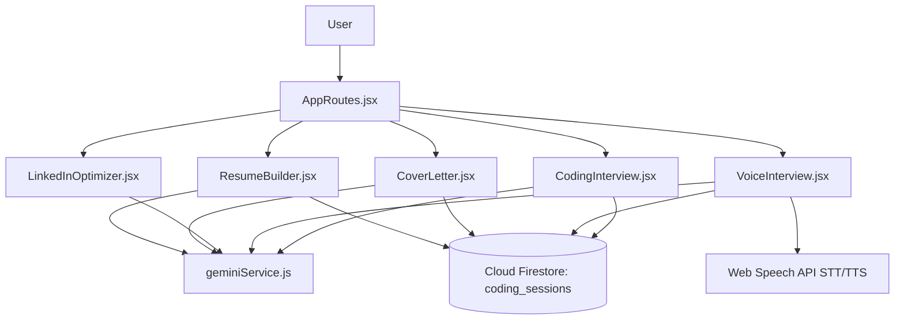

# Walkthrough - SaaS Platform Launch

I have converted HireSense AI into a startup-ready SaaS application by implementing the approved design.

## Features Implemented

1. **AI Resume Builder & Templates (`ResumeBuilder.jsx`)**:
   * Features a split-pane layout: forms on the left, live styled resume on the right.
   * Leverages template themes: **Modern**, **Professional**, and **Creative**.
   * Integrates `generateResumeBulletsWithGemini` to rewrite descriptions with action words and metric targets.
   * Manages **Version History** directly backed by Firestore `resumes_history` collection.
   * Exports high-resolution formatted PDF copies using `jspdf`.

2. **Cover Letter Generator (`CoverLetter.jsx`)**:
   * Uses Gemini AI to build custom, job-specific cover letters using candidate resume histories.
   * Backs history logs in Firestore under the `cover_letters` collection.
   * Supports copying letters to clipboard and downloading them as a formatted PDF.

3. **LinkedIn Optimizer (`LinkedInOptimizer.jsx`)**:
   * Segmented recruiter hook dashboard recommendations.
   * Yields optimized copy-pasteable headline drafts, about/summaries, and action-driven bullet lists.

4. **Hands-free Voice Interview Hub (`VoiceInterview.jsx`)**:
   * Leverages browser native Web Speech API (`webkitSpeechRecognition` and `speechSynthesis`).
   * Vocalizes questions aloud, displays a pulsing CSS audio levels waveform, and transcribes answers in real-time.
   * Evaluated dynamically by Gemini AI for feedback metrics.

5. **AI Coding Practice Drills (`CodingInterview.jsx`)**:
   * Code compiler layout with starter boilerplate code templates.
   * Runs automated time/space complexity analysis, time-slicing evaluations, and yields optimal comment-guided solutions via Gemini.

---

## Technical Architecture

---

## Build Verification

A full production bundle build was executed (`npm run build`). Results compiled successfully:
- All new route targets are correctly split into independent assets (e.g. `CoverLetter-*.js`, `CodingInterview-*.js`, `LinkedInOptimizer-*.js`, `ResumeBuilder-*.js`, `VoiceInterview-*.js`).
- Assets and vendor scripts are fully optimized for rapid browser loads.
